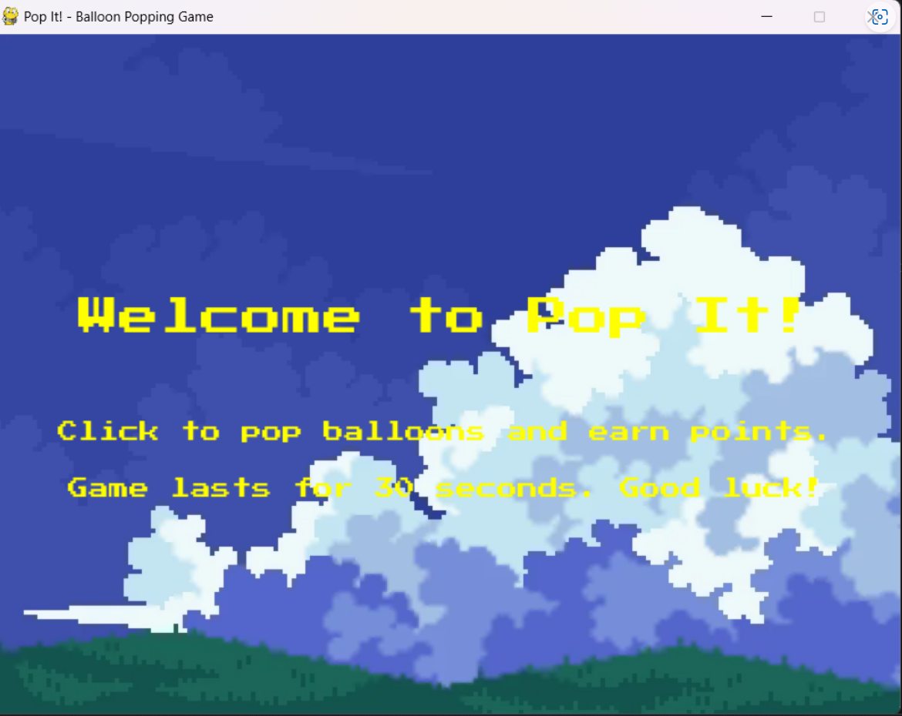
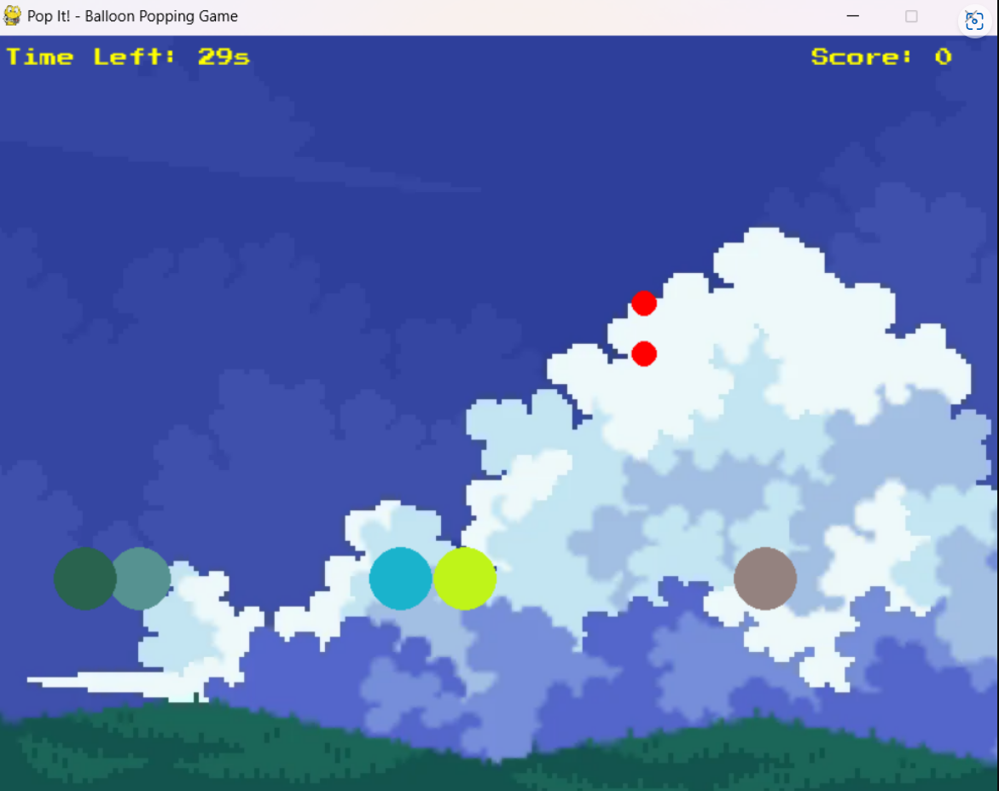
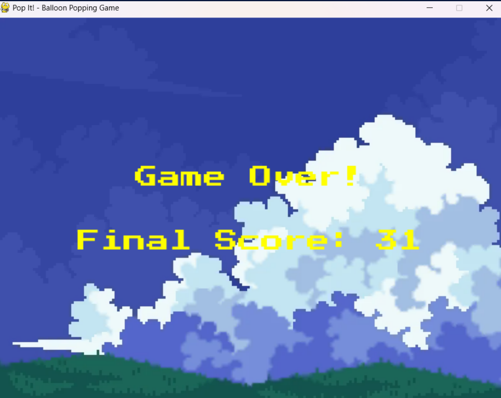

<h1>Pop it!- Balloon Popping Game</h1>
<h3>A balloon popping game created by us using the Pygame library of Python, showing the final score and multicolored ballons with a pixelated vibe</h3>
<h4>The Start Page</h4>

<h4>Game mode</h4>

<h4>Final Score</h4>

